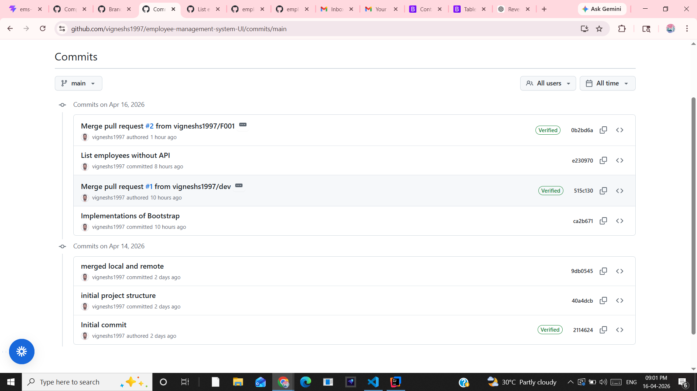

## Project setup

1. npm create vite@latest
2. npm install
3. npm run dev

### employee-management-system-UI

Frontend for employee-management-system

### initializaton of Git

git init

### Adding all the files

git add .

### Staging all the files

git commit -m "Initial Project"

### Changing master branch to main branch as master branch

git branch -M main

### To create new branch

git branch branch-name

### Moving to another branch

git checkout branch-name

### Creating new branch and move to another branch

git checkout -b branch-name

### Adding remote repository

git remote add origin https://github.com/vignesh1997/student-app.git

### Inorder to pull code from the global git rebo

git pull origin main --rebase (or) git rebase --continue

### Abort the broken rebase

git rebase --abort

### Pull with force merge (fix history issue)

git pull origin main --allow-unrelated-histories

### Inorder to push to gloable rebo

git push -u origin main

### If you don’t want this Vim screen

git --no-pager branch

## Crome Extension

React Developer Tool

## Frgment tag

   <></>

## Example Component

  function HelloWorld(){ // text-center is a bootstrap class that centers the text
    return <h1 className="text-center">Hello World!</h1>
}
export default HelloWorld;

## Installing Bootstrap
Bootstrap is a CSS framework to style the web application.
npm install bootstrap --save

 *bootstrap.min.css => Import inside app module

## tab button is used to accept the suggestion

## Development Steps for ListEmployeeComponent

### 1. Create React Functional Component - ListEmployeeComponent

### 2. Prepare Dummy Data (List of Employees) to Display in an HTML Table

### 3. Write JSX Code to  Display List of Employees in HTML Table

### 4. Import and use ListEmployeeComponent in App Component

### 5. Run and Test React App

## The command to create Arrow Function is (rafce - React Arrow Functional Componet Export)

## ES7+ React/Redux/React-Native snippets in VS code

## List Employee Feature - Connect React App with  Get All Employees REST API

### 1. Install axios Library (npm install axios --save)

### 2. Create EmployeeService.js File

### 3. Write REST Client code to make a REST API call using axios API

### 4. Change ListEmployeeComponent to display Response of the REST API (List of Employees)

### 5. Test the above changes

# Merge issue

unfortunately i merged code from F001 to main instead of dev. The component folder is present in the main branch. I could not inherit the component folder from the main to dev with (git pull origin main).

## Step 1

  Please commit the recent changes in the branch you are working first
  git branch => F002
  git add .
  git commit -m "Message"

## Step 2

  Pull the recent code from the main
  git pull main

## Step 3

  Move to dev branch
  git checkout dev

## Step 4
  To know what are all the commits
  git log --name-only
  git log --oneline
## Step 5

  Pick the Component module commit with the main branch with id of e230970 (Component module push to main)
  
  git cherry-pick e230970

## Step 6

  Push the pulled code by using cherry-pick to dev
  git push origin dev

## Step 7

  Inoder to avoid opening pager when we use the command like
  git --no-pager branch

## Adding Header and Footer to React App

### 1. Create HeaderComponent (functional component)

### 2. Import and Use HeaderComponent in App Component

### 3. Create FooterComponent (functional component)

### 4. Import and Use FooterComponent in App Component

## Semantic elements are HTML tags that clearly describe their meaning and purpose

### <header>

### <footer>

### <section>

### <article>

## Bootstrap 5

### container, table, nav bar

## Error: className instead fo class => did you mean className?

# Configure Routing  in a React App(Development Steps)

## 1. Install react-router-dom library using NPM 

### npm install react-router-dom --save

## 2. Configure Routing in App Component

### import { BrowserRouter, Routes, Route } from 'react-router-dom'

## 3. Configure Route for ListEmployeeComponent

<>
      <BrowserRouter>
        <HeaderComponent />
        <Routes>
                   {/*http://localhost:3000*/}
          <Route path='/' element={<ListEmployeeComponent />} ></Route>
                   {/*http://localhost:3000/employees*/}
          <Route path='/employees' element={<ListEmployeeComponent />}></Route>
        </Routes>
        <FooterComponent />
      </BrowserRouter>
    </>

## 4. Test Route for ListEmployeeComponent

# Revert last the merge commit with dev

## Step 1: Go to dev

### git checkout dev

## Step 2: Find merge commit

### git log --oneline

## Step 3: Revert it

### git revert -m 1 <merge_commit_id> or git revert -m 1 abc1234

-m 1 = keep dev as main parent

## Step 4: Push

### git push origin dev
